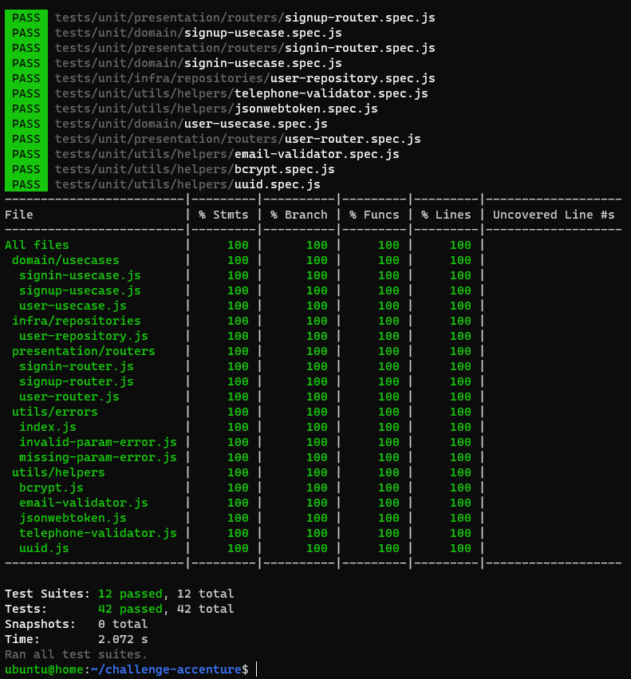

# Challenge Accenture
Simple RESTful API

### Information
Postman collection is at the root of the project `challenge.postman_collection.json`
Application is configured to run with docker, but if running without containers,
just run: `npm run production` or `npm run development`

## Steps to run
1. Install Dependencies
2. Generate RSA Keys
3. Setup Env File
4. Run command or bash script to easy start docker containers

The bash script `bin/postinstall.sh` will generate as rsa keys (`jwtRSA.key` and `jwtRSA.pub`) and the `.env` file on root project

#### Install

It will automatically call `bin/postinstall.sh`
```bash=
    $ npm install
```

#### Start
```bash=
    $ ./bin/start.sh
```

#### Stop
```bash=
    $ ./bin/stop.sh
```

#### Logs
```bash=
    $ ./bin/logs.sh
```

#### Tests
```bash=
    $ npm run test
```

